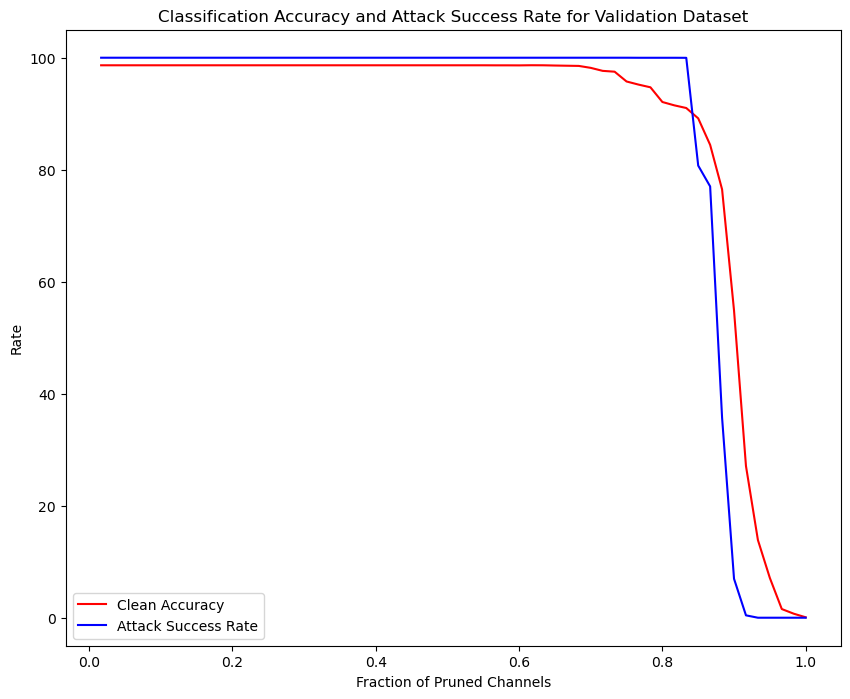
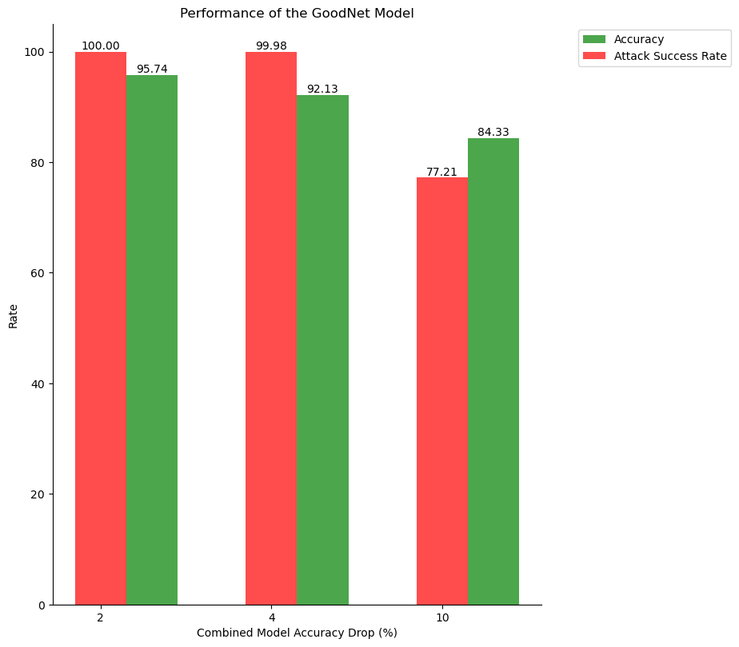

# LAB-4: Backdoor-Attacks
This lab coursework is done as part of the course 'EL-GY-9163: Machine Learning for Cyber-security' offered in Fall 2023

## Table of Contents
1. [Overview](#overview)
2. [Data](#data)
3. [Procedure](#procedure)
4. [Evaluating the Backdoored Model](#eval)
5. [Notes on code execution](#code_exec)
6. [Observations](#obv)

### Overview <a name='overview'></a>
You must do the project individually. In this HW you will design a backdoor detector for BadNets trained on the YouTube Face dataset using the pruning defense discussed in class. Your detector will take as input:
1. *B*, a backdoored neural network classifier with *N* classes.
2. *Dvalid*, a validation dataset of clean, labeled images.

What you must output is *G* a “repaired” BadNet. G has *N+1* classes and given unseen test input, it must: 
1. Output the correct class if the test input is clean. The correct class will be in *[1, N]*.
2. Output class *N+1* if the input is backdoored.

You will design *G* using the pruning defense we discussed in class. That is, you will prune the last convolution layer of BadNet $B$ (the layer just before the FC layers) by removing one channel at a time from that layer. Channels should be removed in increasing order of average activation values over the entire validation set. Every time you prune a channel, you will  measure the new validation accuracy of the newly pruned BadNet. You will stop pruning once the validation accuracy drops at least X% below the original accuracy. This will be your new network $B'$. Now, your GoodNet *G* works as follows. For each test input, you will run it through both $B$ and $B'$. If the classification outputs are the same, i.e., class i, you will output class i. If they differ you will output *N+1*.

Evaluate this defense on:
1. A BadNet, *B1*, (“sunglasses backdoor”) on YouTube Face for which we have already told you what the backdoor looks like. That is, we give you the validation data and test data with examples of clean and backdoored inputs.

### Data <a name='data'></a>
   1. Download the validation and test datasets from [here](https://drive.google.com/drive/folders/1Rs68uH8Xqa4j6UxG53wzD0uyI8347dSq?usp=sharing) and store them under `lab3/data/` directory.
   2. The dataset contains images from the YouTube Aligned Face Dataset. We retrieved 1283 individuals and split them into validation and test datasets.
   3. bd_valid.h5 and bd_test.h5 contains validation and test images with sunglasses trigger respectively, that activates the backdoor for bd_net.h5.

```bash
├── data 
    └── cl
        └── valid.h5 //This is clean validation data used to design the defense
        └── test.h5  //This is clean test data used to evaluate the BadNet
    └── bd
        └── bd_valid.h5 //This is sunglasses-poisoned validation data
        └── bd_test.h5  //This is sunglasses-poisoned test data
├── models
    └── bd_net.h5
    └── bd_weights.h5
├── architecture.py
└── eval.py //This is the evaluation script
```

### Procedure <a name='procedure'></a>

The primary objective of this project was to refine a machine learning model through a series of steps including layer pruning, accuracy-based model saving, vulnerability assessment, and the creation of an optimized composite model.

1. **Layer Pruning and Model Saving:** Our approach involved pruning the `conv_3` layer based on the average activation from the last pooling operation across the validation dataset. We implemented a strategy to save models at specific accuracy drop thresholds of 2%, 4%, and 10%. The models were named `model_X=2.h5`, `model_X=4.h5`, and `model_X=10.h5`, respectively, signifying the accuracy drop percentage.

2. **Vulnerability Assessment:** Notably, we assessed the attack success rate when the model's accuracy dropped by at least 30%. This metric was observed at 6.954187234779596%, indicating a vulnerability threshold.

3. **Model Integration (GoodNet Design):** To enhance the model's performance, we pursued a strategy to combine two models: the flawed or compromised "BadNet" and a refined model post-repair. This process aimed to create a superior composite model, referred to as "GoodNet."

4. **Implementation Details:** The entire program code and implementation steps are detailed in the `MLSec_Lab4_mpj8687.ipynb` file. This file encapsulates the codebase, encompassing the procedures for model creation, pruning, evaluation, vulnerability assessment, and the integration of models to form GoodNet.

### Evaluating the Backdoored Model <a name='eval'></a>
   1. The DNN architecture used to train the face recognition model is the state-of-the-art DeepID network. 
   2. To evaluate the backdoored model, execute `eval.py` by running:  
      `python3 eval.py <clean validation data directory> <poisoned validation data directory> <model directory>`.
      
      E.g., `python3 eval.py data/cl/valid.h5 data/bd/bd_valid.h5 models/bd_net.h5`. This will output:
      Clean Classification accuracy: 98.64 %
      Attack Success Rate: 100 %

### Notes on code execution <a name='code_exec'></a>
- This code is executed locally due to resource constraints in Google Colab
- The links to download the dataset and the corresponding files required for code execution are mentioned in the Data(#data) section above. Make sure to verify and update the path addresses of clean data, poisoned data, and models, according to the data stored in your system before executing the code.
- Please use only clean validation data (valid.h5) to design the pruning defense. And use test data (test.h5 and bd_test.h5) to evaluate the models.

---

### Observations <a name='obv'></a>

After pruning the model, we can use the clean validation data set and test it on the pruned model. The 'Classification Accuracy' and 'Attack Success Rate' upon using the validation dataset are as given in the figure below:



The assessment indicates that the prune defense strategy hasn't been notably successful in reducing the attack success rate. While the rate of successful attacks might not be excessively high, the defense method significantly compromises the accuracy of the model. 

The attack might be resistant to the prune defense method, which means the defense mechanism is ineffective against this specific attack. Additionally, there's suspicion that despite undergoing the pruning defense, the model might still retain vulnerability due to being trained on data that contains malicious elements or has been deliberately manipulated (poisoned data).

In summary, the prune defense strategy appears ineffective in significantly reducing the success rate of attacks against the model. The compromise in model accuracy due to this defense, coupled with the suspicion that the attack method might be immune to this defense technique or the model retains susceptibility from the training data, raises concerns about its overall security.

Comparision of the performance of the repaired model is shown in the figure given below:


Comparision of the performance of the GoodNet model is shown in the figure given below:


